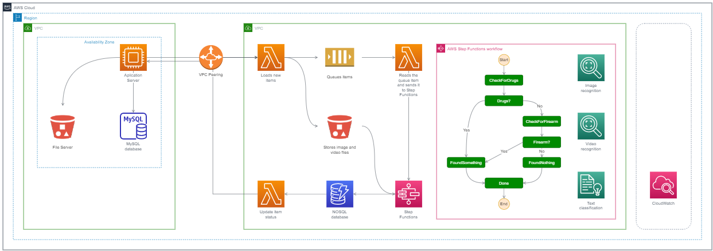

# AWSome Builder 3
Este repositório contém os arquivos do AWSome Builder 3, terceira etapa do programa de capacitação de novos colaboradores da AWS. Outras reuniões foram realizadas com o cliente para identificar o desafio e se aprofundar tecnicamente nos detalhes. Mais informações sobre o programa AWSome Builder podem ser encontradas [aqui](./assets/AWSomeBuilder.md)

Esse projeto aborda a definição de arquitetura de **fila de moderação automatizada** que utiliza componentes de Computação Visual (Computer Vision) para identificar anúncios inapropriados em uma plataforma de Marketplace. O objetivo da PoC é demonstrar como os componentes da AWS podem ser combinados para desenvolver tal solução de maneira altamente disponível, escalável, segura e com modelo de consumo baseado na quantidade de anúncios (sem custo fixo). 

Assim, deu-se preferência para utilização de serviços gerenciados (que não demandam a utilização e operação de servidores) na composição da solução:

* Serviço de armazenamento:
  * **Amazon Simple Storage Service (S3)** = Armazenamento de objetos construído para armazenar e recuperar qualquer volume de dados de qualquer local.

* Serviço de banco de dados:
  * **Amazon DynamoDB** = Serviço de bando de dados NoSQL rápido e escalonável.

* Serviço computacional:
  * **AWS Lambda** = Permite executar códigos sem provisionar ou gerenciar servidores.
  * **AWS Step Functions** = Cria funções em aplicações essenciais para a empresa.
  
* Serviço de mensageria:
  * **Amazon Simple Queue Service (SQS)** = Filas de mensagens gerenciadas para microsserviços, sistemas distribuídos e aplicativos sem servidor.
  
* Serviço de rede:
  * **Amazon VPC** = Provisiona uma seção da nuvem AWS, logicamente isolada, na qual é possível executar recursos da AWS em uma rede virtual que o cliente definir.
  * **Amazon VPC peering** = Uma conexão de rede entre dois VPCs que permite rotear o tráfego entre eles.

* Serviço de gerenciamento:
  * **Amazon CloudWatch** = Capacidade de observação dos seus recursos da AWS e aplicativos na AWS e no local.

## Definição da Calculadora

* Durante a criação das calculadoras de preços, os valores definidos para essa prova de conceito foram:

* Mensalmente o produtor vai carregar em chamadas com 4 itens 250.000 vezes totalizando 1 milhão de itens, a média de tamanho de cada item é de 250kb, totalizando 250gb.

* Todas essas chamadas serão carregadas no AWS Lambda I que irá distribuir os dados de texto para o SQS tendo em média 5kb, totalizando 1 milhão de solicitações; arquivos contendo videos ou imagens serão armazenado no S3 onde foi designado o espaço de 5gb para armazenamento.

* Os itens do SQS são destinados para o AWS Lambda II onde serão lidos e, juntamente com os arquivos armazenados no S3, são enviados para o AWS Step Functions no qual, através de uma cadeia de AWS Lambdas (III ao VI), verifica-se se algum item é suspeito como, por exemplo, algum item relacionado a drogas ou armas de fogo. Foi considerado nesse filtro um valor de 5% sobre todos os itens como sendo impróprios.

* Esses itens impróprios para o consumidor são armazenados no Amazon DynamoDB e os outros são enviados para o AWS Lambda VII e terá status atualizado.

* Todo esse processo é feito em um Amazon VPC, enquanto em um segundo Amazon VPC existe um Aplication Server que recebe os dados vindos do AWS Lambda VII e direciona para um File Server e para um MySQL database pronto para consulta do cliente.

* O link feito através dos dois Amazons VPC é feito por um Amazon VPC peering.

Arquitetura final da PoC:

Para a calculadora de preço foram utilizados valores retirados do próprio site da AWS no qual é possivel adiquirir esses produtos.

Abaixo estão todos os preços, descontos e parâmetros utilizados para cada produto:

**Amazon Simple Storage Service (S3)** - Considerado 5gb de armazenamento por USD 0,12 sendo USD 0,12 de desconto.

**Amazon DynamoDB** - Considerado 5gb de armazenamento, esse valor não ultrapassa o pacote grátis que a AWS disponibiliza mensalmente de 25gb.

**AWS Lambda**:
* I - 250.000 de solicitações lendo uma a cada três segundos e alocando 512mb de memória.
* II - 1.000.000 de solicitações lendo uma por segundo e alocando 128mb de memória.
* III - 1.000.000 de solicitações lendo uma a cada três segundos e alocando 128mb de memória.
* IV - 1.000.000 de solicitações lendo uma por segundo e alocando 128mb de memória.
* V - 1.000.000 de solicitações lendo uma por segundo e alocando 128mb de memória.
* VI - 1.000.000 de solicitações lendo uma por segundo e alocando 128mb de memória.
* VII - 1.000.000 de solicitações lendo uma por segundo e alocando 128mb de memória.

**AWS Step Functions** - Considerado 1 milhão de transações a USD 0,025 para cada mil transações.

**Amazon Simple Queue Service (SQS)** - Considerado 1 milhão de solicitações e 250gb para data tranfer in e data transfer out.

**Amazon VPC** - Considerado 250gb de transfer in e 5gb de transfer out.

**Amazon VPC peering** - Considerado a soma de ambos VPCs, 255gb

**Amazon CloudWatch** - Valor inferior ao pacote grátis mensal.

Abaixo a planilha com todos os valores para a calculadora de preços. Foi adotado valor com 8 casas decimais depois da virgula para melhor entendimento do valor unitário.

### CALCULADORA TÉCNICA

**Tipos de Serviços** | **Produto AWS** | **Preço Produto (USD)** | **Preço Desconto Free Tier (USD)** | **Preço Total (USD)** | **Preço Unitário (USD)**
-----|----|----|----|----|----|
Armazenamento | S3 | 0,12000000 | 0,12000000 | 0,00000000 | 0,00000000
Banco de dados | DynamoDB | 0,00000000 | 0,00000000 | 0,00000000 | 0,00000000
Computacional | Lambda I | 6,30125000 | 0,98114286 | 5,32010714 | 0,00000532
Computacional | Lambda II | 2,28375000 | 0,98114286 | 1,30260714 | 0,00000130
Computacional | Lambda III | 25,2050000 | 0,98114286 | 24,22385714 | 0,00002422
Computacional | Lambda IV | 2,28375000 | 0,98114286 | 1,30260714 | 0,00000130
Computacional | Lambda V | 2,28375000 | 0,98114286 | 1,30260714 | 0,00000130
Computacional | Lambda VI | 2,28375000 | 0,98114286 | 1,30260714 | 0,00000130
Computacional | Lambda VII | 2,28375000 | 0,98114286 | 1,30260714 | 0,00000130
Computacional | Step Functions | 25,00000000 | 0,10000000 | 24,90000000 | 0,00002490
Mensageria | SQS | 22,41000000 | 1,26000000 | 21,15000000 | 0,00002115
Rede | VPC | 0,36000000 | 0,18000000 | 0,18000000 | 0,00000018
Rede | VPC peering | 2,55000000 | 0,18000000 | 2,37000000 | 0,00000237
**TOTAL** | | **93,36500000** | **8,70800000** | **84,65700000** | **0,00008466** 

Abaixo os valores agrupados.

### CALCULADORA EXECUTIVA

**Tipos de Serviços** | **Produto AWS** | **Preço Produto (USD)** | **Preço Desconto Free Tier (USD)** | **Preço Total (USD)** | **Preço Unitário (USD)**
-----|----|----|----|----|----|
Armazenamento | S3 | 0,12000000 | 0,12000000 | 0,00000000 | 0,00000000
Banco de dados | DynamoDB | 0,00000000 | 0,00000000 | 0,00000000 | 0,00000000
Computacional | Lambda | 42,92500000 | 6,86800000 | 36,05700000 | 0,00003606
Computacional | Step Functions | 25,00000000 | 0,10000000 | 24,90000000 | 0,00002490
Mensageria | SQS | 22,41000000 | 1,26000000 | 21,15000000 | 0,00002115
Rede | VPC | 0,36000000 | 0,18000000 | 0,18000000 | 0,00000018
Rede | VPC peering | 2,55000000 | 0,18000000 | 2,37000000 | 0,00000237
**TOTAL** | | **93,36500000** | **8,70800000** | **84,65700000** | **0,00008466** 
