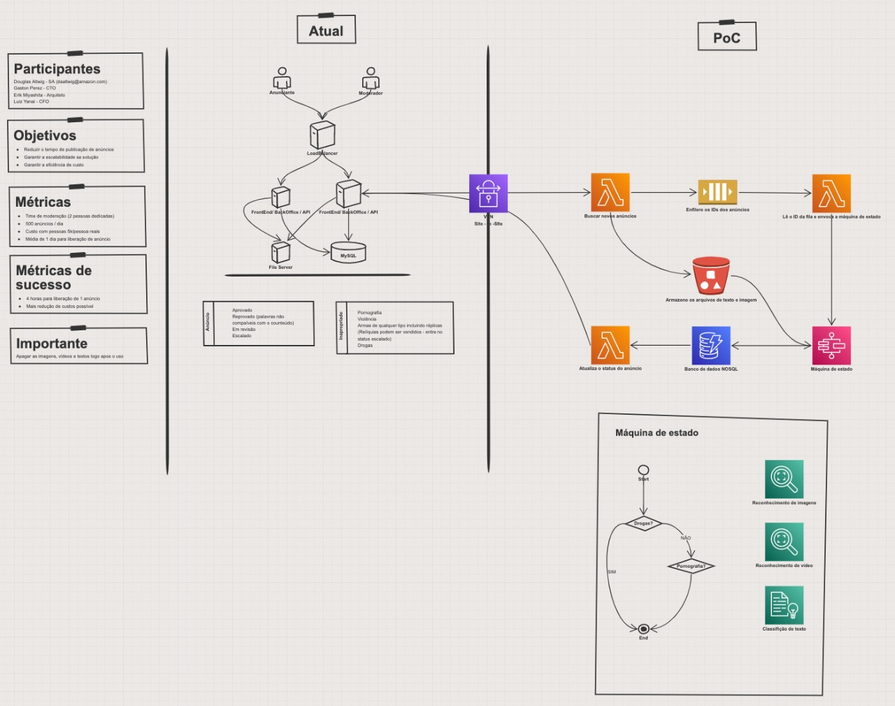

# Introdução

O AWSome Builder é um programa de capacitação que visar preparar colaboradores recém contratados para empregarem as boas práticas de comunicação e políticas da AWS no atendimento ao cliente. Para isso, o programa é divido em três etapas, cada uma delas é marcada por uma reunião com um cliente fictício, a Octank.

A Octank é uma empresa multinacional de grande porte e atua em diferentes áreas. Isso possibilita o emprego de diversas soluções AWS e torna necessário questionar os participantes da reunião para entender o cenário atual do cliente.

## Reunião 1

O objetivo da primeira reunião é ganhar a confiança do cliente. Nela são abordados os seguites assuntos:
* Proposta de valor da computação em nuvem;
* Modelo de consumo;
* Infraestrutura global;
* Portifólio de serviços; 
* Modelo de responsabilidade compartilhada;
* Ecosistema de parceiros; 
* Jornada para a nuvem;

Durante a apresentação, a proposta de valor é sumarizada como as seis principais razões que levam os cliente a escolher a empresa:

* Agilidade;
* Economia de custo;
* Elasticidade;
* Inovar mais rápido;
* Global em minutos;
* Amplitude e profundidade;

Em seguida os dados sobre a **Infraestrutura Global** são apresetados: quantidade Pontos de Presença, o conceito de Região e Zonas de Disponibilidade para garantir a alta-disponibilidade dos serviços. Logo depois, o tópico **Amplitude e Profundidade** faz referência aos +175 serviços oferecidos e também à quantidade de recursos em cada um desses serviços. No **Modelo de Responsabilidade Compartilhada** os clientes mantêm o controle da segurança que implementam para proteger os próprios dados e aplicações assim como fariam em um ambiente on-premises, enquanto que a AWS se responsabiliza pelos componentes de infraestrutura subjacentes. Além disso, os cliente podem contar com o grande **Ecosistema de parceiros** da AWS que podem ser divididos em 2 principais categorias: Integradores de Sistemas e Fornecedores de Software independentes. E, por fim, é apresentada a **Jornada para nuvem** na qual os clientes ganham experiência e maturidade para fazer o melhor uso póssivel dos serviços oferecidos.

## Reunião 2

Na segunda reunião objetivo é se aprofundar tecnicamente no cenário descrito pelo cliente ao longo da primeira reunião. Essa reunião pode contar com apresença de figuras técnicas com gerentes, arquitetos e desenvolvedores para facilidar o aprofundamento. Assim, a reunião tem um formato de WhiteBoarding, na qual os requisitos, métricas e pontos importantes são definitos e o desenho de arquitetura é feito junto com o cliente. 

## Reunião 3

Na terceira e última reunião, o objetivo é apresentar ao cliente o desenho de arquitetura final, o resultado da Prova de Conceito (PoC) assim como a calculadora de preços. Dessa forma o cliente tem acesso aos insumos necessários para tomar decisões com relação à carga de trabalho de interesse. Dependendo do problema e dos componentes de arquitetura, a solução não possui custo fixo e o cliente paga somente pelo que utilizar.

